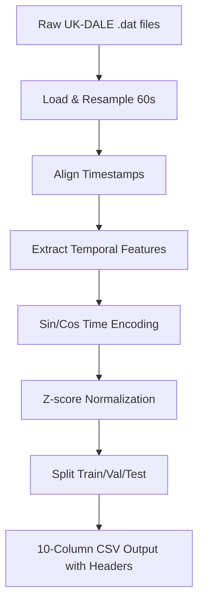

# Multivariate Preprocessing Commands
# 多变量预处理命令

## Quick Start 快速开始

```bash
# Fridge (冰箱)
python multivariate_ukdale_preprocess.py --appliance_name fridge --data_dir "data/UKDALE/"

# Microwave (微波炉)
python multivariate_ukdale_preprocess.py --appliance_name microwave --data_dir "data/UKDALE/"

# Kettle (水壶)
python multivariate_ukdale_preprocess.py --appliance_name kettle --data_dir "data/UKDALE/"

# Dishwasher (洗碗机)
python multivariate_ukdale_preprocess.py --appliance_name dishwasher --data_dir "data/UKDALE/"

# Washing Machine (洗衣机)
python multivariate_ukdale_preprocess.py --appliance_name washingmachine --data_dir "data/UKDALE/"
```

## 📊 Data Processing Pipeline

### Overview



### Step-by-Step Process

#### Step 1: Load Raw Data

**Code Location**: Lines 106-115, 146-151

```python
# Load aggregate (mains) data
mains_df = load_dataframe(args.data_dir, house_id, channel=1)

# Load appliance data  
app_df = load_dataframe(args.data_dir, house_id, channel=appliance_channel)
```

**Input**: `.dat` files with Unix timestamps and power values
**Output**: Pandas DataFrames

#### Step 2: Timestamp Alignment & Resampling

**Code Location**: Lines 153-193

```python
# Convert to datetime
mains_df['time'] = pd.to_datetime(mains_df['time'], unit='s')
app_df['time'] = pd.to_datetime(app_df['time'], unit='s')

# Align timestamps and resample to 60 seconds
df_align = mains_df.join(app_df, how='outer').\
    resample('60S').mean().bfill(limit=1)
```

**Why 60 seconds?**
- Reduces data size while preserving patterns
- Standard sampling rate for NILM research
- Balances temporal resolution and computational efficiency

#### Step 3: Extract Temporal Features & Sin/Cos Encoding

**Code Location**: Lines 172-203

**Following NILMFormer Method**:

```python
# Extract temporal features from timestamp
minute = df_align['time'].dt.minute      # 0-59
hour = df_align['time'].dt.hour          # 0-23
dayofweek = df_align['time'].dt.dayofweek  # 0-6 (0=Monday, 6=Sunday)
month = df_align['time'].dt.month        # 1-12

# Sin/Cos encoding for cyclical features
# This preserves the cyclical nature of time (e.g., 23:00 is close to 00:00)
df_align['minute_sin'] = np.sin(2 * np.pi * minute / 60.0)
df_align['minute_cos'] = np.cos(2 * np.pi * minute / 60.0)
df_align['hour_sin'] = np.sin(2 * np.pi * hour / 24.0)
df_align['hour_cos'] = np.cos(2 * np.pi * hour / 24.0)
df_align['dow_sin'] = np.sin(2 * np.pi * dayofweek / 7.0)
df_align['dow_cos'] = np.cos(2 * np.pi * dayofweek / 7.0)
df_align['month_sin'] = np.sin(2 * np.pi * month / 12.0)
df_align['month_cos'] = np.cos(2 * np.pi * month / 12.0)

# Select columns (remove timestamp, use sin/cos encoded time features)
df_align = df_align[['aggregate', appliance_name,
                     'minute_sin', 'minute_cos',
                     'hour_sin', 'hour_cos', 
                     'dow_sin', 'dow_cos',
                     'month_sin', 'month_cos']]
```

**Why Sin/Cos Encoding?**

1. **Preserves Cyclical Nature**: 
   - 23:00 and 00:00 are mathematically close (distance ≈ 0.26)
   - Without encoding: |23 - 0| = 23 (very far)
   - With encoding: √[(sin(23)-sin(0))² + (cos(23)-cos(0))²] ≈ 0.26 (close!)

2. **Mathematical Property**:
   - sin²(θ) + cos²(θ) = 1 (always true)
   - This validates encoding correctness

3. **Unique Mapping**:
   - Each time point has unique (sin, cos) coordinates
   - No ambiguity (unlike using only sin or only cos)

4. **Matches NILMFormer**:
   - Based on NILMFormer config: `list_exo_variables = [minute, hour, dow, month]`
   - Uses same encoding formulas

**Time Feature Formulas**:

| Feature | Range | Period | Sin Formula | Cos Formula |
|---------|-------|--------|-------------|-------------|
| Minute | 0-59 | 60 | `sin(2π × minute / 60)` | `cos(2π × minute / 60)` |
| Hour | 0-23 | 24 | `sin(2π × hour / 24)` | `cos(2π × hour / 24)` |
| DOW | 0-6 | 7 | `sin(2π × dow / 7)` | `cos(2π × dow / 7)` |
| Month | 1-12 | 12 | `sin(2π × month / 12)` | `cos(2π × month / 12)` |

**Purpose**: Provide temporal context for multivariate diffusion models with proper cyclical encoding

#### Step 4: Z-score Normalization

**Code Location**: Lines 261-266

```python
# Get normalization parameters
mean = params_appliance[appliance_name]['mean']
std = params_appliance[appliance_name]['std']

# Apply Z-score normalization
df_align['aggregate'] = (df_align['aggregate'] - AGG_MEAN) / AGG_STD
df_align[appliance_name] = (df_align[appliance_name] - mean) / std
```

**Formula**:
```
normalized_value = (original_value - mean) / std
```

**Denormalization** (for visualization/evaluation):
```
original_value = normalized_value * std + mean
```

#### Step 5: Train/Val/Test Split

**Code Location**: Lines 277-291

```python
# Split ratios
validation_percent = 20  # 20%
testing_percent = 20     # 20%
training_percent = 60    # 60%

# Split data
test = train.tail(test_len)
val = train.tail(val_len) 
# Remaining data is training set
```

### Output Format

#### 10-Column CSV (from multivariate_ukdale_preprocess.py)

**New Format with Headers** ✅

| Column | Type | Range | Description |
|--------|------|-------|-------------|
| aggregate | float | Z-score | Normalized total power |
| appliance | float | Z-score | Normalized appliance power |
| minute_sin | float | [-1, 1] | Minute sin encoding |
| minute_cos | float | [-1, 1] | Minute cos encoding |
| hour_sin | float | [-1, 1] | Hour sin encoding |
| hour_cos | float | [-1, 1] | Hour cos encoding |
| dow_sin | float | [-1, 1] | Day of week sin encoding |
| dow_cos | float | [-1, 1] | Day of week cos encoding |
| month_sin | float | [-1, 1] | Month sin encoding |
| month_cos | float | [-1, 1] | Month cos encoding |

**Example CSV**:
```csv
aggregate,appliance,minute_sin,minute_cos,hour_sin,hour_cos,dow_sin,dow_cos,month_sin,month_cos
-0.4182,-0.5714,0.8660,0.5000,-0.5000,-0.8660,0.0,1.0,-0.8660,-0.5
-0.4187,-0.5714,0.9135,0.4067,-0.5000,-0.8660,0.0,1.0,-0.8660,-0.5
-0.4022,-0.5714,0.9511,0.3090,-0.5000,-0.8660,0.0,1.0,-0.8660,-0.5
```

**Key Features**:
- ✅ **Headers included**: Column names in first row
- ✅ **10 columns**: 2 power + 8 time features (4 × 2 sin/cos)
- ✅ **Sin/Cos encoding**: Preserves cyclical nature of time
- ✅ **NILMFormer compatible**: Matches NILMFormer time feature configuration

**Validation**:
```python
# Verify sin² + cos² = 1
df['minute_sin']**2 + df['minute_cos']**2  # Should equal 1.0
df['hour_sin']**2 + df['hour_cos']**2      # Should equal 1.0
df['dow_sin']**2 + df['dow_cos']**2        # Should equal 1.0
df['month_sin']**2 + df['month_cos']**2    # Should equal 1.0
```

## 🔧 Normalization Parameters

### Current Parameters (from code)

```python
params_appliance = {
    'kettle': {
        'mean': 700,
        'std': 1000,
        'houses': [2],
        'channels': [8],
    },
    'microwave': {
        'mean': 500,
        'std': 800,
        'houses': [2],
        'channels': [15],
    },
    'fridge': {
        'mean': 200,
        'std': 400,
        'houses': [2],
        'channels': [14],
    },
    'dishwasher': {
        'mean': 700,
        'std': 1000,
        'houses': [2],
        'channels': [13],
    },
    'washingmachine': {
        'mean': 400,
        'std': 700,
        'houses': [2],
        'channels': [12],
    }
}

AGG_MEAN = 522  # Aggregate mean
AGG_STD = 814   # Aggregate std
```

### Recommended Parameters (calculated from actual UK-DALE data)

Based on analysis of Building 1 and 2 combined data:

```python
# Option 1: Actual calculated values
params_appliance = {
    'kettle': {'mean': 13, 'std': 168},
    'microwave': {'mean': 25, 'std': 177},
    'fridge': {'mean': 47, 'std': 50},
    'dishwasher': {'mean': 49, 'std': 305},
    'washingmachine': {'mean': 38, 'std': 232},
}
AGG_MEAN = 409
AGG_STD = 502

# Option 2: Transformer project values (well-tested)
params_appliance = {
    'kettle': {'mean': 100, 'std': 500},
    'microwave': {'mean': 60, 'std': 300},
    'fridge': {'mean': 50, 'std': 50},      # ← Almost perfect match!
    'dishwasher': {'mean': 700, 'std': 1000},
    'washingmachine': {'mean': 400, 'std': 700},
}
AGG_MEAN = 400
AGG_STD = 500
```

### Impact of Different Parameters

**Using smaller mean/std** (actual values):
- ✅ More accurate normalization
- ✅ Data matches actual distribution
- ⚠️ Larger normalized value range
- ⚠️ May need model retraining

**Using larger mean/std** (original values):
- ✅ Compatible with existing models
- ✅ Smaller normalized value range
- ⚠️ Less accurate normalization
- ⚠️ May not match actual data distribution

### How to Calculate Your Own Parameters

```bash
# Run the statistics calculator
python preprocessing/calculate_ukdale_stats.py
```

This will output recommended mean/std values based on your actual UK-DALE data.

## Output 输出

生成的文件位于 `created_data/UK_DALE/`:

```
washingmachine_training_.csv      # 训练集 (10列 with headers)
washingmachine_validation_.csv    # 验证集 (10列 with headers)
washingmachine_test_.csv          # 测试集 (10列 with headers)
```

**CSV Format**:
```csv
aggregate,appliance,minute_sin,minute_cos,hour_sin,hour_cos,dow_sin,dow_cos,month_sin,month_cos
-0.4182,-0.5714,0.8660,0.5000,-0.5000,-0.8660,0.0,1.0,-0.8660,-0.5
...
```

**Columns**:
- 2 power features (Z-score normalized)
- 8 time features (sin/cos encoded, range [-1, 1])

## Apply Algorithm 1 应用Algorithm 1

过滤有效部分并保留时间特征:

```bash
python Data_filtering/algorithm1_v2_multivariate.py --appliance_name fridge
```

输出: `Data/datasets/fridge_multivariate.csv` (5列: appliance, minute, hour, day, month)

## Verify Data 验证数据

```bash
# 检查CSV格式
python preprocessing/check_csv_format.py

# 分布对比
python "Data Quality Checking/distribution_comparison.py"

# 时间数据查看器
python "Data Quality Checking/temporal_data_viewer.py"
```

## Complete Workflow 完整流程

```bash
# Step 1: 预处理 (生成6列CSV)
python multivariate_ukdale_preprocess.py \
  --appliance_name fridge \
  --data_dir "data/UKDALE/"

# Step 2: 应用Algorithm 1 (过滤并生成5列CSV)
python Data_filtering/algorithm1_v2_multivariate.py \
  --appliance_name fridge

# Step 3: 验证数据分布
python "Data Quality Checking/distribution_comparison.py"

# Step 4: 训练多变量扩散模型
# (使用 Data/datasets/fridge_multivariate.csv)
```

## Parameters 参数说明

### multivariate_ukdale_preprocess.py

- `--appliance_name`: 电器名称 (必需)
- `--data_dir`: UK-DALE数据目录 (推荐: "NILM-main/dataset_preprocess/UK_DALE/")
- `--save_path`: 输出目录 (默认: "created_data/UK_DALE/")
- `--aggregate_mean`: 总功率均值 (默认: 522W)
- `--aggregate_std`: 总功率标准差 (默认: 814W)

### algorithm1_v2_multivariate.py

- `--appliance_name`: 电器名称 (必需)
- `--input_file`: 输入CSV (默认: created_data/UK_DALE/{appliance}_training_.csv)
- `--output_dir`: 输出目录 (默认: "Data/datasets")
- `--window`: Algorithm 1窗口长度 (默认: 100)
- `--clip_max`: 可选，裁剪最大值 (Watts)
- `--remove_spikes`: 移除孤立尖峰 (默认: True)

## Troubleshooting 故障排除

### 错误: FileNotFoundError

```bash
# 确保使用正确的数据路径
python multivariate_ukdale_preprocess.py \
  --appliance_name fridge \
  --data_dir "data/UKDALE/"
```

### 错误: PermissionError

```
PermissionError: [Errno 13] Permission denied: 'created_data/UK_DALE/fridge_training_.csv'
```

**原因**: CSV文件正在被其他程序打开（如Excel、VSCode等）

**解决方案**:
1. 关闭所有打开的CSV文件
2. 关闭VSCode中打开的CSV文件
3. 重新运行脚本

### 错误: 找不到Python

```bash
# 使用完整路径
& "c:/Users/Raymond Tie/Desktop/DiffusionModel_NILM/.venv/Scripts/python.exe" \
  preprocessing/multivariate_ukdale_preprocess.py \
  --appliance_name fridge \
  --data_dir "data/UKDALE/"
```

## Notes 注意事项

- **图表已关闭**: `debug = False` 以加快处理速度
- **关闭CSV文件**: 运行前确保所有CSV文件已关闭
- **数据路径**: 使用相对路径 `data/UKDALE/`
- **归一化参数**: 建议使用实际计算的统计值以获得最佳性能
- **时间特征**: 保持原始整数值，不进行归一化


生成的文件位于 `created_data/UK_DALE/`:

```
fridge_training_.csv      # 训练集 (6列: aggregate, appliance, minute, hour, day, month)
fridge_validation_.csv    # 验证集
fridge_test_.csv          # 测试集
```

## Apply Algorithm 1 应用Algorithm 1

过滤有效部分并保留时间特征:

```bash
python Data_filtering/algorithm1_v2_multivariate.py --appliance_name fridge
```

输出: `Data/datasets/fridge_multivariate.csv` (5列: appliance, minute, hour, day, month)

## Verify Data 验证数据

```bash
# 检查CSV格式
python preprocessing/check_csv_format.py

# 分布对比
python "Data Quality Checking/distribution_comparison.py"

# 时间数据查看器
python "Data Quality Checking/temporal_data_viewer.py"
```

## Complete Workflow 完整流程

```bash
# Step 1: 预处理 (生成6列CSV)
python multivariate_ukdale_preprocess.py \
  --appliance_name fridge \
  --data_dir "data/UKDALE/"

# Step 2: 应用Algorithm 1 (过滤并生成5列CSV)
python Data_filtering/algorithm1_v2_multivariate.py \
  --appliance_name fridge

# Step 3: 验证数据分布
python "Data Quality Checking/distribution_comparison.py"

# Step 4: 训练多变量扩散模型
# (使用 Data/datasets/fridge_multivariate.csv)
```

## Parameters 参数说明

### multivariate_ukdale_preprocess.py

- `--appliance_name`: 电器名称 (必需)
- `--data_dir`: UK-DALE数据目录 (推荐: "NILM-main/dataset_preprocess/UK_DALE/")
- `--save_path`: 输出目录 (默认: "created_data/UK_DALE/")
- `--aggregate_mean`: 总功率均值 (默认: 522W)
- `--aggregate_std`: 总功率标准差 (默认: 814W)

### algorithm1_v2_multivariate.py

- `--appliance_name`: 电器名称 (必需)
- `--input_file`: 输入CSV (默认: created_data/UK_DALE/{appliance}_training_.csv)
- `--output_dir`: 输出目录 (默认: "Data/datasets")
- `--window`: Algorithm 1窗口长度 (默认: 100)
- `--clip_max`: 可选，裁剪最大值 (Watts)
- `--remove_spikes`: 移除孤立尖峰 (默认: True)

## Troubleshooting 故障排除

### 错误: FileNotFoundError

```bash
# 确保使用正确的数据路径
python multivariate_ukdale_preprocess.py \
  --appliance_name fridge \
  --data_dir "data/UKDALE/"
```

### 错误: PermissionError

```
PermissionError: [Errno 13] Permission denied: 'created_data/UK_DALE/fridge_training_.csv'
```

**原因**: CSV文件正在被其他程序打开（如Excel、VSCode等）

**解决方案**:
1. 关闭所有打开的CSV文件
2. 关闭VSCode中打开的CSV文件
3. 重新运行脚本

### 错误: 找不到Python

```bash
# 使用完整路径
& "c:/Users/Raymond Tie/Desktop/DiffusionModel_NILM/.venv/Scripts/python.exe" \
  multivariate_ukdale_preprocess.py \
  --appliance_name fridge \
  --data_dir "data/UKDALE/"
```

## Notes 注意事项

- **图表已关闭**: `debug = False` 以加快处理速度
- **关闭CSV文件**: 运行前确保所有CSV文件已关闭
- **数据路径**: 使用相对路径 `data/UKDALE/`
